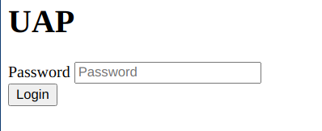
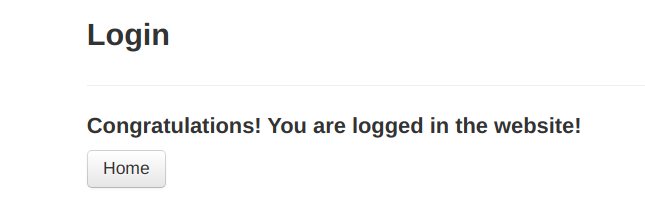

# PROJECT 2 - AUTHENTICATION

## Work done by:
- Pedro Monteiro 97484
- Renato Dias 98380
- Eduardo Fernandes 98512
- José Trigo 98597


## Introduction
Our project is constituted by three parts: the app we built for the first project, the UAP and E-CHAP.
    

## UAP

The User authentication application (UAP) was developed using Python and Flask, and it represents the user in the authentication process.

The user start to insert a password to see the registered DNS and logins, that will be saved in hash (SHA-512) in file (*pass.txt*).
A random IV will also be generated and saved in a file named *cbc.iv*.
<br>Through the inserted password, it will be generated the key (stored in *key.key* file) used to encrypt JSON dictionary with DNS and logins ({dns:[user:password]}).
This is made by the function *generate_key(password)*
<br>In adiction to this function, we used others like:
- *encrypt_data(data)*: used to encrypt the dictionary using AES and CBC cipher mode
- *decrypt_data(data)*: function used to decrypt the dictionary
- *generate_hash*: used to generate words's initial hash


## E-CHAP

The E-CHAP protocol allows the authentication of users in the login process of the Web app.

Each entity involved in the authentication will generate a new challenge and send it along with their reply to the last challenge they received, in a total of N rounds. If both entities reply correctly to all the challenges, the authentication is successful. If one of the rounds fails, they just keep exchanging challenges. The entity that detected the incorrect reply will answer incoming challenges with random replies until the N rounds are completed as to not reveal to a potential attacker the moment of the incorrect reply.

In terms of implementation, we have an important global variable:

- 'N' variable holds the number of rounds in the E-CHAP process

We considered that N=10 would be a reasonable value for the number of rounds involved in the E-CHAP protocol. 

## THE PROTOCOL USED


## INSTRUCTIONS 

We built a docker-compose file containing all tools necessary to run both server and UAP.
<br>To run it, just have to enter the following command in terminal, inside app_sec folder 
```
docker-compose up
```
<br>Website will be available at http://172.18.0.2:80
<br>To access UAP use the password **password** and then select the credentials.
<br>Just credentials containing username **admin** can be authenticated.

## EXAMPLES

### UAP LOGIN


### LIST OF SAVED DNS


### IF THE CREDENTIALS ARE WRONG


### SUCCESSFUL LOGIN
